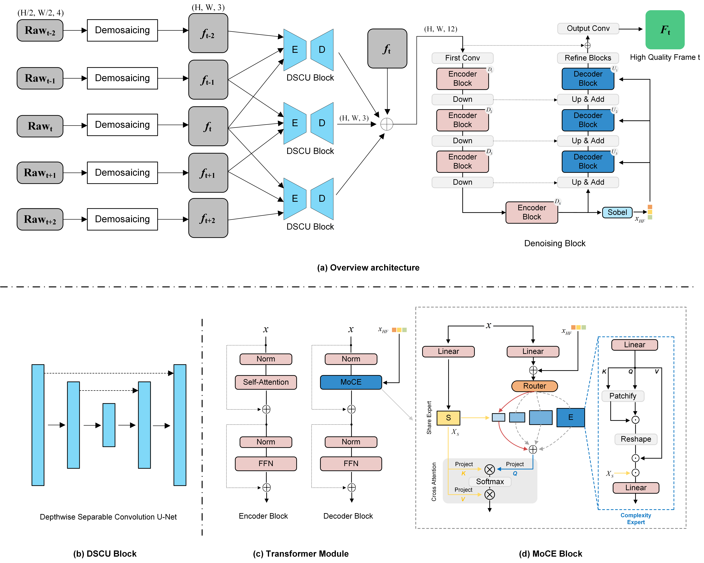
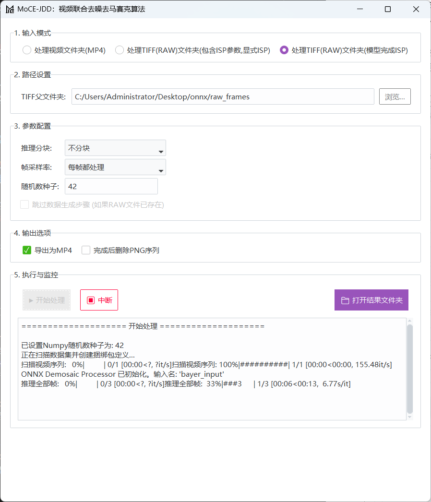

 # MoCE-JDD 算法运行说明文档

## 模型概述
如图所示，MoCE-JDD 是一个面向算力约束场景设计的RAW视频联合去噪与去马赛克模型。
它创造性地采用了三阶段级联架构：首先，使用高效的Hamilton-Adams算法进行快速去马赛克；
接着，通过一个轻量化的深度可分离卷积U-Net网络（DSCU Block）进行初步的特征提取与去噪；
最后，利用一个集成了创新性混合复杂度专家（MoCE）模块与Transformer的非对称网络进行自适应的精细恢复。
该模型的核心优势在于，它能根据视频内容的复杂性动态分配计算资源，在严格满足低参数量（≤1M）和低计算量（4K单帧≤1T FLOPs）的条件下，
高效地实现了高质量的视频恢复，并保证了优异的时序一致性。

核心的MoCE网络是一个采用了U形架构的模型，具有非对称的编码器-解码器设计。
首先用一个 3×3 卷积从退化的输入中提取浅层特征，然后这些特征会经过四个层级的编码和解码阶段。
这两个阶段都使用了 Transformer 模块，并将一个新颖的混合复杂度专家（MoCE）层 集成到了解码器模块中。
为了进一步增强解码器的特征丰富化能力，本文用一个尺寸为3×3，中心值为8，其余位置全为-1的Sobel滤波器提取全局特征向量，从而引入高频引导， 以提升门控函数的频域感知能力。
最后，一个全局残差连接将浅层特征与细化模块的输出相连，在生成修复图像之前对关键的高频细节进行细化。


## 运行说明
操作系统为Windows 11 <br>
进入项目目录:
````
cd MoCE-JDD
````
创建一个conda环境:
````
conda create -n jdd python=3.9
conda activate jdd
````
安装依赖包<br>
如果仅需使用onnx模型进行推理测速，执行以下命令
````
pip install -r requirements.txt
````
requirements.txt不包含torch、torchvision和lightning，如果需要使用pytorch模型进行推理测试或者训练，需要进一步安装完整环境，命令如下：<br>
安装pytorch(根据实际情况选择cuda版本)
````
pip install torch torchvision --index-url https://download.pytorch.org/whl/cu126
````
安装lightning和ptflops
````
pip install lightning==2.0.1
````

### **模型推理**
##### CMD方式(pytorch,可用GPU)
--video_path example 为待推理的TIFF格式的RAW数据(RGGB顺序)的路径，请将所有待推理的视频数据的子文件夹直接放在该文件夹中，**并修改为你的路径**<br>
```plaintext
<raw_tiff_folder>/
├── <video_sequence_A>/
│   ├── 00000001.tiff
│   ├── 00000002.tiff
│   └── ...
└── <video_sequence_B>/
    ├── 00000001.tiff
    ├── 00000002.tiff
    └── ...
```
结果会保存在**results**文件夹中
````
python inference_raw.py  --video_path example --tiling 16 example 
````
可以选择 --tiling 8 参数分块推理，防止显存不足
##### GUI方式
按照说明填写参数点击运行即可。<br>
结果会保存在**results**文件夹中
````
cd onnx
python MoCE-JDD.py
````
为了便于快速测试，我还打包了一份exe，免去环境配置的麻烦，直接点击MoCE-JDD_release/MoCE-JDD.exe文件运行程序即可…^—^…<br><br>

输入或者选择待推理图片文件夹和输出路径后点击开始推理按钮即可！

### **模型训练**
#### step1: 准备数据集
所用到的数据集及其下载链接已放置在datasets目录下，请根据里面提供的链接和指引下载数据集<br>
#### step2: 训练模型<br>
训练模型的命令如下：<br>

`````
python train.py --gt_type srgb \
--loss_type multi_vgg \
--vgg_loss_weight 0.8 --fft_loss_weight 0.05 \
--balance_loss_weight 0.01 --batch_size 12 \
--patch_size 208 --exp_name MoCE_JDD \
--with_complexity \
--fft_loss --cosine_loss \
--data_file_dir datasets \
--val_file_dir datasets/ZTE_Example \
--num_gpus 1 --lr 2e-4 --epochs 30 \
--ckpt_dir src/checkpoints --num_workers 6 
`````

--data_file_dir 为数据集路径<br>
--num_gpus 为使用的GPU数量<br>
--ckpt_dir 为模型保存路径<br>
--val_file_dir 为验证集路径<br>
--loss_type 为损失函数类型，可选择multi_vgg vgg L1<br>
--vgg_loss_weight 为VGG损失权重<br> 
--loss_fn 为损失函数，可选择L1 L2<br>
--pixel_loss_weight 为像素损失权重<br>
--ms_ssim_loss 为是否使用MS-SSIM损失<br>
--ms_ssim_weight 为MS-SSIM损失权重<br>
--aux_l2_loss 为是否使用辅助L2损失<br>
--aux_l2_weight 为辅助L2损失权重<br>
--use_fft_loss 为是否使用FFT损失<br>
--fft_loss_fn 为FFT损失函数，可选择L1 L2<br>
--fft_loss_weight 为FFT损失权重<br>
--balance_loss_weight 为平衡损失权重<br>
--batch_size 为batch大小<br>
--patch_size 为patch大小<br>
--lr 为学习率<br>
--epochs 为训练轮数<br>
--num_workers 为数据加载线程数<br>
--val_file_dir 为验证集路径<br>
--exp_name 为实验名称<br>

#### step3：训练过程监控<br>
训练过程中会在logs目录下生成一个logs文件夹，里面存放了训练过程中的日志文件，可使用tensorboard可视化训练过程<br>
````
tensorboard --logdir=/logs/<exp_name>/lightning_logs/version_0
````
<exp_name> 为训练过程中的实验名称

### **各个代码文件作用简介**
文件夹下的其他文件作用如下：
- **validation.py**：用于进行模型验证的脚本。
````
python validation.py --exp_name MoCE_JDD --gt_type srgb
````
- **validation_block.py**：用于进行模型验证的脚本(分块推理)。
- **train.py**：用于训练模型的脚本。
- **export_onnx.py**：用于将PyTorch模型转换为ONNX格式并进行推理的脚本。
- **options.py**：用于输入模型选项和参数的脚本，即args。
- **val_CRVD**：测试CRVD数据集。

src/data文件夹下的文件作用如下：
- **crvd_dataset.py**：CRVD数据集类，加载和预处理数据。
- **dataset.py**：数据集类，加载和预处理数据。
- **Hamilton_Adam.py**：Hamilton-Adam算法实现。
- **unprocessor.py**: 反处理和加噪流程，以及正向ISP实现类。
- **TVD_video_to_frames.py**：TVD视频帧提取。
- **Video-MME_video_to_frames.py**：Video-MME视频帧提取。

src/net文件夹下的文件作用如下：
- **moce_jdd.py**：模型定义。

src/utils文件夹下的文件作用如下：
- **image_utils.py**：图像处理辅助函数
- **pytorch_ssim/__init__.py**：结构相似性计算
- **schedulers.py**：学习率调度策略
- **test_utils.py**：测试评估工具集
- **val_utils.py**：验证指标计算
- **weight_schedule.py**：动态权重调整
- **loss_utils.py**：损失函数定义。


