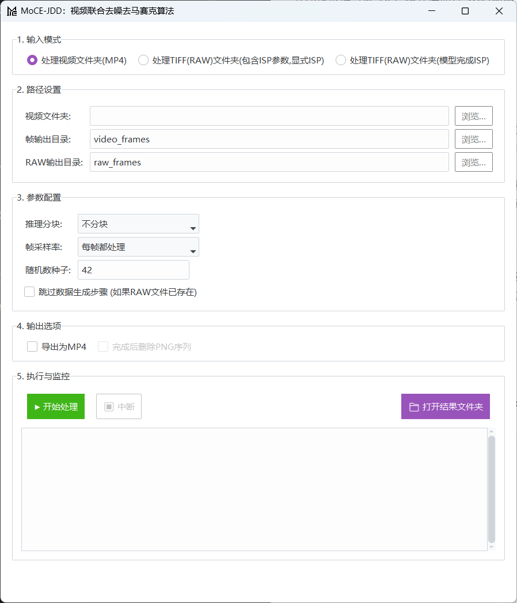

# MoCE-JDD：视频联合去噪去马赛克算法

MoCE-JDD 是一个集成了图形用户界面（GUI）的强大工具，专门用于视频的去噪和去马赛克处理。它实现了一套完整的处理流水线：从未经处理的视频文件（如 MP4）开始，首先通过逆向图像信号处理（Inverse ISP）流程生成模拟的、带噪声的 RAW 格式图像数据（以 TIFF 格式存储），然后利用 ONNX 深度学习模型进行高质量的去噪和去马赛克，最终输出清晰的视频。

## 应用界面

## 核心功能

  * **多种输入模式**: 支持直接处理 MP4 视频文件夹，或处理已经生成好的 RAW TIFF 图像序列(**RGGB通道顺序**)。
  * **模拟RAW数据生成**: 内置了复杂的逆向 ISP 流程（`unprocessor_np.py`），能够将标准 sRGB 图像转换为带有真实噪声模式的模拟 RAW 数据。
  * **高效ONNX推理**: 采用 ONNX Runtime 进行核心算法的推理，确保了跨平台的高性能和高效率。
  * **分块推理机制**: 对于高分辨率视频，支持分块（Tiling）推理，有效降低了内存消耗，使得在有限资源的设备上处理大尺寸图像成为可能。
  * **完整的ISP流程**: 不仅包含了从 sRGB 到 RAW 的逆向过程，还包含了从 RAW 到 sRGB 的正向 ISP 流程，用于正确地可视化处理结果。
  * **用户友好的GUI**: 基于 `ttkbootstrap` 构建了直观易用的图形界面，让用户可以轻松配置各项参数并监控处理进度。
  * **自动化批处理**: 能够自动处理文件夹内的所有视频，并将结果序列导出为 MP4 文件。

## 工作流程

本项目的处理流程主要分为两大阶段：

1.  **数据预处理阶段（从 MP4 到 RAW TIFF）**
    此阶段在选择“处理视频文件夹(MP4)”模式时激活。

    ```
    MP4 视频文件
         │
         ▼
    [ 视频抽帧 ] → 保存为 PNG 图像序列
         │
         ▼
    [ 逆向ISP处理 (sRGB → RAW) ]
    (在 unprocessor_np.py 中实现)
    1. 逆色调映射
    2. Gamma 扩展 (线性化)
    3. 逆色彩校正 (CCM)
    4. 逆白平衡
    5. 拜耳镶嵌 (Mosaicing)
         │
         ▼
    [ 添加合成噪声 ] → 模拟散粒噪声和读出噪声
         │
         ▼
    [ 保存为 TIFF ] → 将浮点型 RAW 数据与 ISP 元数据一同存入 .tiff 文件
    ```

2.  **核心处理阶段（从 RAW TIFF 到去噪 MP4）**
    此阶段是项目的主要处理环节。

    ```
    RAW TIFF 图像序列 (带元数据)
         │
         ▼
    [ 数据加载器 ] → 读取 TIFF 文件，捆绑成帧束 (如5帧)
         │
         ▼
    [ 初始去马赛克 (ONNX) ] → 使用 Hamilton-Adam 算法的ONNX模型进行快速去马赛克
         │
         ▼
    [ 核心模型推理 (ONNX) ] → 输入去马赛克后的帧束，进行联合去噪与细节增强
         │
         ▼
    [ 正向ISP处理 ]
    (在 unprocessor_np.py 中实现)
    1. 白平衡与亮度增益
    2. 色彩校正 (CCM)
    3. Gamma 压缩
    4. 色调映射
         │
         ▼
    [ 保存结果 ] → 保存为 PNG 图像序列
         │
         ▼
    [ 视频合成 ] → (可选) 将处理后的 PNG 序列合成为 MP4 视频
    ```

## TIFF 数据存取与元数据处理

在本项目中，TIFF 格式扮演着至关重要的角色。它不仅能够无损地存储浮点型的 RAW 图像数据，还能通过其 `description` 标签来嵌入处理该 RAW 图像所必需的 ISP 元数据。这确保了在后续的正向 ISP 流程中，能够使用完全匹配的参数（如白平衡增益、色彩校正矩阵等）来还原图像，从而保证色彩的准确性。

### 1\. 存储 TIFF 数据与元数据

在数据预处理阶段，当一帧 PNG 图像被转换为模拟的带噪 RAW 数据后，程序会将其与对应的 ISP 参数一同保存。这个过程在 `MoCE-JDD.py` 的 `_process_single_frame_worker` 函数中完成。

**核心代码如下：**

```python
# MoCE-JDD.py

def _process_single_frame_worker(args_tuple):
    frame_file, raw_output_folder, shared_metadata = args_tuple
    # ... (省略图像读取和逆向ISP处理的代码) ...
    _, raw_noise, _, _ = unprocessor.forward(
        image, add_noise=True, rgb2cam=shared_metadata['rgb2cam'],
        rgb_gain=shared_metadata['rgb_gain'], red_gain=shared_metadata['red_gain'],
        blue_gain=shared_metadata['blue_gain'], shot_noise=shared_metadata['shot_noise'],
        read_noise=shared_metadata['read_noise']
    )
    
    frame_name = os.path.splitext(os.path.basename(frame_file))[0]
    raw_path = os.path.join(raw_output_folder, f"{frame_name}.tiff")

    # 1. 准备ISP参数字典
    isp_params = {
        'red_gain': float(shared_metadata['red_gain']), 
        'blue_gain': float(shared_metadata['blue_gain']),
        'rgb_gain': float(shared_metadata['rgb_gain']), 
        'rgb2cam': shared_metadata['rgb2cam'].tolist() # 将numpy数组转为列表以便JSON序列化
    }
    
    # 2. 将字典转换为JSON字符串
    metadata_json = json.dumps(isp_params, indent=4)
    
    try:
        # 3. 使用 tifffile.imwrite 将图像数据和元数据一同写入文件
        #    raw_noise 是浮点型numpy数组
        #    metadata_json 作为 description 参数传入
        tifffile.imwrite(raw_path, raw_noise.astype(np.float32), description=metadata_json)
        return True, frame_file
    except Exception as e:
        print(f"保存TIFF {raw_path} 时出错: {e}")
        return False, frame_file
```

### 2\. 读取 TIFF 数据与元数据

在核心处理阶段开始时，数据加载器需要从 TIFF 文件中同时读出 RAW 图像数据和嵌入的 ISP 元数据。这个功能由 `read_tiff_with_isp_metadata` 函数实现。

**核心代码如下：**

```python
# MoCE-JDD.py

def read_tiff_with_isp_metadata(tiff_path):
    if not os.path.exists(tiff_path): raise FileNotFoundError(f"文件未找到: {tiff_path}")
    
    # 1. 使用上下文管理器打开TiffFile
    with tifffile.TiffFile(tiff_path) as tif:
        # 2. 读取图像数据为numpy数组
        image_data = tif.asarray()
        
        # 3. 从第一页的标签中获取 'ImageDescription' 标签的值
        metadata_json = tif.pages[0].tags.get('ImageDescription', None)
        
        if metadata_json is None: return image_data, None
        
        # 4. 解析JSON字符串，还原为Python字典
        isp_params = json.loads(metadata_json.value)
        
        # 5. (可选) 将字典中的特定键值（如CCM矩阵）转换回numpy数组
        if 'rgb2cam' in isp_params:
            isp_params['rgb2cam'] = np.array(isp_params['rgb2cam'])
            
        return image_data, isp_params
```

## 如何使用

1.  **环境配置**: 双击MoCE-JDD.exe启动程序
2.  **模式选择**:
      * **处理新视频**: 选择“处理视频文件夹(MP4)”。
      {video_foler}
      |-- {video_name}.mp4
      |_
      * 😀 **处理已有RAW**: 根据你的RAW数据是否需要外部ISP，选择“处理TIFF(RAW)文件夹(包含ISP参数,显式ISP)”或“处理TIFF(RAW)文件夹(模型完成ISP)”。

### **模式二：处理已有的 RAW 数据**

如果您已经拥有符合格式的 RAW 图像序列（TIFF 格式），可以选择此模式跳过视频预处理步骤。这分为两种情况：

#### **1. 处理带 ISP 参数的 TIFF (显式 ISP)**

此模式适用于每一个 TIFF 文件都内嵌了恢复图像所需的 ISP（图像信号处理器）参数的情况。

  * **要求**：
      * TIFF 文件的 `ImageDescription` 字段必须包含一个 JSON 字符串。
      * 该 JSON 字符串需包含以下五个关键 ISP 参数：`red_gain`, `blue_gain`, `rgb_gain`, 和 `rgb2cam` 色彩校正矩阵。
  * **输入目录结构**：
    程序会扫描您指定的 "TIFF 父文件夹"，并将其下的每一个子文件夹视为一个独立的视频序列。
    ```plaintext
    <raw_tiff_folder>/
    ├── <video_sequence_A>/
    │   ├── 00000001.tiff
    │   ├── 00000002.tiff
    │   └── ...
    └── <video_sequence_B>/
        ├── 00000001.tiff
        ├── 00000002.tiff
        └── ...
    ```

#### **2. 处理纯 RAW 数据的 TIFF (模型完成 ISP)**

此模式适用于原始的、不包含任何 ISP 元数据的 TIFF 文件，所有的色彩和亮度还原将由模型自动完成。

  * **要求**：
      * 输入的 TIFF 文件应为 **RGGB** 通道顺序的 RAW 数据。
  * **说明**：
      * 程序将自动处理，无需提供额外参数。
      * 项目附带的 `example` 文件夹内有此格式的样例数据可供参考。
    
  * **输入目录结构**：
    与上一个模式相同，程序会将 "TIFF 父文件夹" 下的每个子文件夹作为一个独立的视频序列进行处理。
      

3.  **路径设置**:
      * 在视频模式下，指定包含 `.mp4` 文件的**输入文件夹**，以及用于存放中间文件（帧序列和RAW序列）的**输出目录**。
      * 在TIFF模式下，指定包含一个或多个视频序列子文件夹的**TIFF父文件夹**。
5.  **参数配置**:
      * **推理分块**: 根据你的显存/内存大小选择。对于高分辨率视频（如4K），建议选择“4块”或“8块”。
      * **帧采样率**: 可以选择跳帧处理以加快速度，例如“每2帧处理1帧”。
      * **随机数种子**: 用于确保RAW数据生成过程的可复现性。
6.  **输出选项**:
      * 勾选“导出为MP4”可以在处理完成后自动将结果PNG序列合成为视频。
      * 勾选“完成后删除PNG序列”可以在视频合成后清理中间文件，以节省磁盘空间。
7.  **开始处理**: 点击“▶ 开始处理”按钮。处理日志会实时显示在下方的监控窗口中。处理完成后，可以点击“📁 打开结果文件夹”查看输出文件。


## 文件结构与模块说明

  * `MoCE-JDD.py`: 项目主文件，包含GUI界面、事件处理和整个处理流程的调度逻辑。
  * `unprocessor_np.py`: 核心的图像处理模块。
      * `ImageUnprocessor`: 实现了从 sRGB 到带噪 RAW 的**逆向ISP**流程。
      * `IspProcessor`: 实现了从 RAW 到 sRGB 的**正向ISP**流程。
      * `HamiltonAdam`: Hamilton-Adams 去马赛克算法的 NumPy 实现。
  * `demo_onnx.py`: 一个示例脚本，展示了如何将一个支持动态尺寸的 Hamilton-Adams 去马赛克 PyTorch 模型导出为 ONNX 格式。项目中所使用的 `hamilton_adam_demosaic.onnx` 模型便是由此脚本生成。
  * `image_utils.py`: 包含图像保存等辅助功能（注意：`MoCE-JDD.py` 中内置了这些函数的实现）。
  * `models/`: 存放 ONNX 模型文件的目录（例如 `model.onnx`, `model_isp.onnx`, `hamilton_adam_demosaic.onnx`）。
  * `results/`: 默认的输出文件夹，用于存放处理后的图像序列和视频。